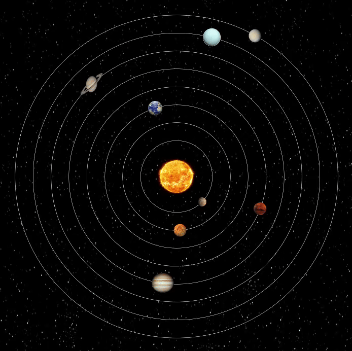

# Solar System Simulation in Java


A dynamic 2D simulation of the solar system, illustrating the orbits and movement of planets around the Sun. This project uses the **StdDraw** graphics library for visual rendering.



## Features

* **Physics Simulation:** Position calculations based on gravitational laws (N-Body simulation).
* **Graphical Visualization:** Rendering of planets with textures, starfield background, and orbit tracing.
* **Smooth Animation:** Real-time rendering loop.
* **Complete System:** Includes the Sun and the 8 planets (Mercury, Venus, Earth, Mars, Jupiter, Saturn, Uranus, Neptune).

## Prerequisites

To run this project, you need:

* **Java Development Kit (JDK) 8** or higher.
* An IDE (VS Code, IntelliJ, Eclipse) or a simple terminal.
* Image files (textures) must be present in the root folder or `images/` directory.

## Installation and Usage

### 1. Clone the project
```bash
git clone [https://github.com/JustinF02/Projet--Java-Systeme-Solaire.git](https://github.com/JustinF02/Projet--Java-Systeme-Solaire.git)
cd Projet--Java-Systeme-Solaire